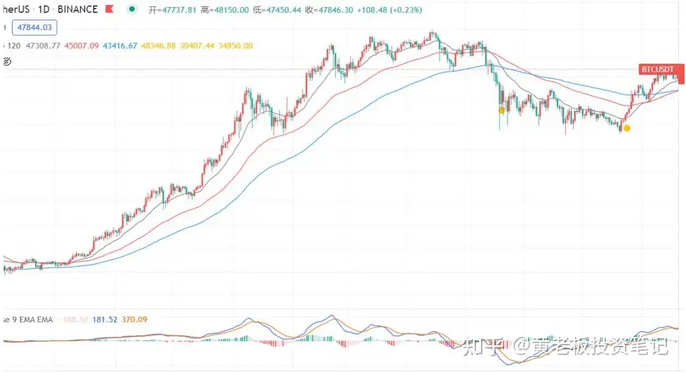

# 法师XTony-滚仓交易心法--交易员的自我修养-3

## 四、关注大 V 的行情分析，能赚到钱吗?

很遗憾，并不能，行情分析不能作为开平仓的理由。

更何况绝大多数行情分析都在说压力位支撑位，其实稍微学学你自己也能找。

逢高做空， 逢低做多这种就是一句废话，一个完整的开单逻辑应该包括点位，方向，仓位，止损点和止盈点。

也就是说，只有明确了点位，仓位，和止损位的分析，才有值得跟的价值，否则最好还是别看，没啥意义。

市场中只有两种人可以赚到钱:

1.真正的交易高手;

2.100%复制高手开单的人，是 100%。

除了这这两种人，其余的全部赚不到，最怕的是自己分析一半参考别人一半。 交易是一件孤独的事情，你需要有自己的想法，自己的看法，而人又是一种群体性动物， 需要博得他人认同。

孤独感会让我们缺乏安全感，继而想看看别人的观点，是否与自己相同。

一旦相同，我们就会感觉舒心很多，一旦不同，我们又充满了焦虑。所以最好是，行情分析， 一概不看。

（曹老师？超话里面各种带单老师？懂了吧）

其中也包括我的，建议你们多关注下我说的关于交易理念，心法的东西，而不是关注我看多看空/开多开空了，真的没有用。

技术分析并不是不可或缺的，别是一点都不懂就行，会看压力支撑就行了，余下的都是靠长期的经验积累盘感，卖油翁唯手熟尔，看再多 A 片也不如自己来一炮。

经常听到有人说: 上涨行情中，2W 我下车了，结果涨到了 5W; 下跌行情中，4W 我就下车了，结果跌到了 3W。 其实并不是只有韭菜如此，大多大 V 也会经常出现这种情况。

后面我会教大学如何吃到大部分行情，方法很简单，傻逼都会，真的是傻逼都会。为什么傻逼都会我们很多人却做不到呢?

因为知易行难，你或许看过懂了，但你一时半会做不到。

我们做不到的原因恰恰就是因为我们不是傻逼，所以还不如当个傻逼，傻逼都是赚钱的。

交易难的是如何知道，执行，做到，如何克制住自己内心的贪欲控制住自己的手，交易真正的功夫都在 K 线之外。

后面我会讲一套趋势交易系统，很简单，各位都能看懂，也能很容易的复制。

复杂的东西能不能赚到钱我不知道，但是简单的东西一定可以赚到钱，相信自己，交易没你想的那么复杂。

小李飞刀为啥那么牛逼，就是快!你再牛逼，我比你快，你有个鸟用。

散打比赛中为何都是同一个重量级的才能比赛，因为在绝对的力量面前，任何技巧都是扯淡。你耍了半天，对方一拳就把你打趴下了。

花里胡哨的东西，大多都是中看不中用

## 五、概率在交易中的应用

之前的课程里说过，为什么要做趋势交易，根据期货公司的统计，做趋势成功率高，做趋势交易的基础概率高，我们做这个成功的概率就会高，这个就是概率。

技术分析是历史经验的总结，其有效性是以概率形式出现的。

双顶形态一定跌吗，也有可能变成一个震荡箱体上涨中继;我们经常说金叉多死叉空， 金叉一定涨吗，也有可能叉完震荡了，只能说金叉的时候 K 线已经涨了导致均线已经抬头产生金叉，涨的概率在增大。

一切都只是概率而已。 概率中有个大数法则，大数法则是说在随机事往件的大量重复出现中，往呈现某种几乎必然的规律，这个规律就是大数定律。

说人话就是:

假如没有计划生育重男轻女，男女比例一定是无限接近于 1:1 的;

抛硬币猜正反面，只要次数足够多，正反一定也是接近 1:1 的。

只要你开单开的足够多，对错比例几乎是 1:1 的

跟扔筛子抛硬币没有任何区别，也就是说你判断的多空，其实还不如抛硬币，因为抛硬币不费脑子。 你们去看看那些实盘，排名靠前的，大多数交易胜率都在50%左右，是不是这样。

在交易里，你单笔交易是亏是赚，丝毫没有任何意义，哪怕你连续五笔交易都是亏也没有意义。

一套正期望值的交易系统，总会有一连串盈利的时候，也总会有一连串亏损的时候。如果你的交易系统是一个验证过的正数学期望的交易系统，只要你交易的次数足够多，你最后一定会是赚的。

当你明白了大数法则的意义，在交易的过程中，面对连续错误、不断小额亏损情况，你会很淡定。既然结局一定会是赚的，你为何要为一次两次的失败，止损而难过，焦躁不安呢?

肯定有人会说，既然不如抛硬币，你为什么还要分析那么多判断多空呢?

首先，我是个博主，我发微博或者谈观点，多空我必须说个方向的，我不说别人就会骂我不是多就是空。

但你们不是啊，你们是来交易赚钱的。

其次，虽然判断多空的胜率和抛硬币差不多，但盈亏比并不是，比如在一段上升趋势中， 虽然做多做空没区别，但盈亏比有区别。

在上升趋势中，往上的空间远大于往下的空间，所以你要做多。

这个不是判断出来的，而是跟随出来的，上升趋势，就做多，不用判断。

我们经常听人说，不要抄底摸顶，但你知道为什么不要抄底摸顶吗? 同样是概率。

<!--  -->

比如这段从 1W 多到 6W 的趋势行情，中间起码有三四个明显的回调，但只有一个真正的顶。

3 个回调 1 个顶，赌回调继续做多赢的概率是 75%，赌顶赢的概率只有 25%，也就是说，只要看到回调，就去做多，是回调的概率是远远大于是顶的概率，所以要在回调的时 候做多，而不是摸顶。

成功就是做大概率对的事情。

至于有些人说我判断到底到顶了，或者说到顶了我再卖，世界上压根就没有这种判断的技术，没有人可以判断到底到顶了，都只是概率，当出现 XX 新号，到顶的概率会增加，当出现 XX 新号，见底的概率会增加……

仅仅只是概率可能大一点，就像阴天了，下雨的概率 就会大一些，并不是说阴天了就肯定要下雨。

要多用概率思维理解交易。

