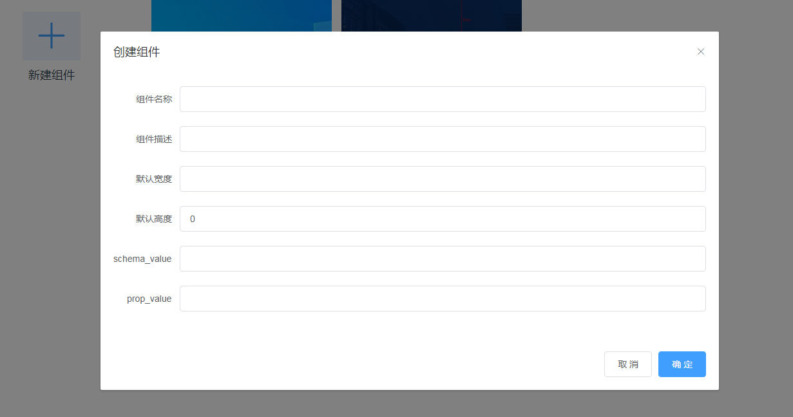
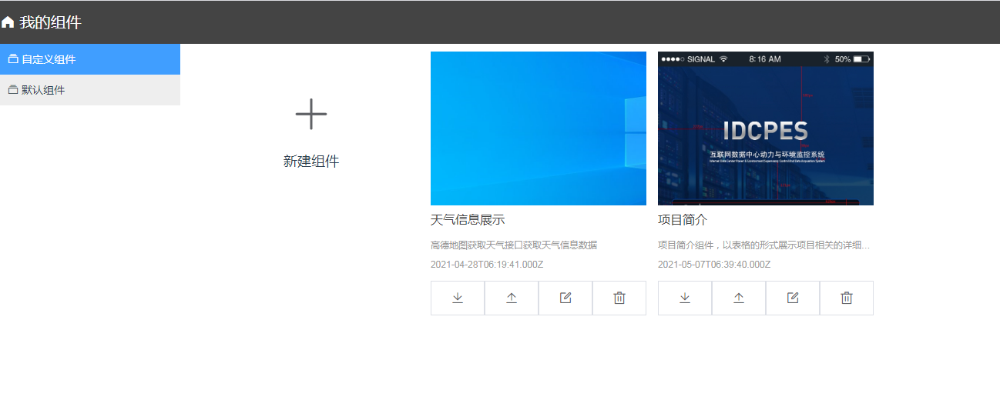

#### 创建组件 <!-- {docsify-ignore} -->

开发组件前，需先创建组件来定义组件名称、类型和功能特性描述，便于组件发布后引导开发者使用。本文介绍如何在组件开发工作台创建组件。

#### 新增组件
1. 登录UIStudio后，在工程管理界面右上角点击组件列表按钮。
2. 在组建列表界面选择自定义组件 > 新建组件。
3. 在新建组件对话框，设置组件基本信息。

 
<!--  -->

| 参数	| 配置说明 |
| :---- | :---- |
| 组件名称 |	自定义组件名称。建议输入便于识别的名称。仅支持中文汉字、英文字母、数字、下划线（_）、连接号（-）和英文圆括号（()），且必须以中文汉字、英文字母或数字开头，长度不超过30个字符（一个中文汉字算一个字符）。说明 组件创建完成后，支持修改组件的名称。|
| 组件描述  |	输入描述信息介绍组件用途。该描述将在组件预览时展示。单击确认。组件创建完成，进入IoT Studio组件开发页面，开始开发个人新组件。具体操作，请参见开发个人组件。 |
| 默认宽度 | 	组件在预览时默认的宽度 数值如 **200** ,后面无需给单位，默认单位px |
| 默认高度 | 		组件在预览时默认的宽度 数值如 **200** ,后面无需给单位，默认单位px |

#### 个人组件列表
查看自定义组件列表，您可在组件列表查看到已创建的个人组件列表及组件的相关信息。

  

定位到目标组件，在组件下面的操作栏单击以下操作。

| 操作	| 说明 |
| :---- | :---- |
| 下载组件开发模板 |	新建组件下载开发模板。如已上传组件代码包，下载最新一次的代码包。|
| 上传开发组件压缩包	| 上传在模板基础上修改好的组件代码压缩包。|
| 编辑	| 编辑该组件的信息。|
| 删除	| 删除开发中的组件。注意 如果组件已发布，不再显示该功能。|

#### 后续步骤
组件基本信息创建完成后，开始开发组件属性和功能。具体操作，请参见开发关联项目组件。

