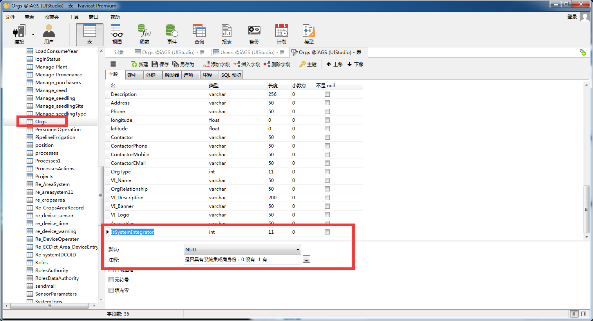
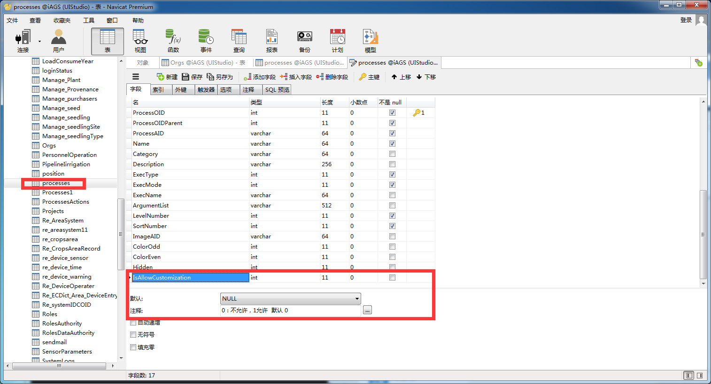

### 一、框架

#### 1、Node框架更新 yjApp.middle.crossDomain.js 文件，内容如下：

```
function crossDomain(req,res,next){
  res.header("Access-Control-Allow-Methods", "DELETE,PUT,POST,GET,OPTIONS");
    res.header("Access-Control-Allow-Headers", req.headers["access-control-request-headers"]?req.headers["access-control-request-headers"]:"*");
    res.header("Access-Control-Allow-Origin", req.headers.origin?req.headers.origin:"*");
    res.header("Access-Control-Allow-Credentials", true);
  next();
}
yjGlobal.app.use(crossDomain);
```


#### 2、BizServer框架

a)	在biz文件夹下面添加文件夹UIstudioService , 再在UIstudioService文件夹下面添加loginCheck.{post}.{m}.js文件。

> loginCheck.{post}.{m}.js

```
var yjSecurity = global.yjRequire("yujiang.Foil","yjSecurity.js");
// var yjDBService = global.yjRequire("yujiang.Foil").yjDBService;
var yjDBService = yjRequire("yujiang.Foil",'yjDBService.js'); 

var yjDB = global.yjRequire("yujiang.Foil").yjDB;
var async = require("async");

module.exports = function(sender) {
	// let serviceHost = sender.req.body.serviceHost ;
	let UserName = sender.req.body.userName;
	let Password = sender.req.body.password ;
	let g_data = null ;
	// let obj = {};
	// let OrgData = [];

	if(!UserName){
		sender.success({status:0,message:'用户名不能为空！'});
		return;
	}

	if(!Password){
		sender.success({status:0,message:'密码不能为空！'});
		return;
	}
	
	let passwordDBRaw = yjSecurity["Diffie-Hellman"].decrypt(Password);

	if(!passwordDBRaw){
		// sender.success({status:0,message:'密码解密失败！'});
		sender.success({status:0,message:'密码错误！'});
		return;
	}
	

	function checkLogin(cb){
		//TypeAID='1.Company' 系统集成厂商
		let sql = " SELECT * FROM Users u "+
		"LEFT JOIN Orgs o ON u.OrgOID = o.OrgOID "+
		"LEFT JOIN alltypes b ON o.OrgType = b.TypeValue AND b.Category = 'OrgType' "+
		"WHERE u.UserAID =?"; // AND b.TypeAID='1.Company' " ; 

		yjDBService.exec({
			sql:sql,
			parameters:[UserName],
			success : function(data){
				data = yjDB.dataSet2ObjectList(data.meta,data.rows);
				if(!data || data.length==0){
					cb('用户名错误！');
					return;
				}

				if(data[0].TypeAID != '1.Company'){
					cb('请确认该账号是否为公司账号，其他账号不支持自定义界面配置！');
					return;
				}

				let isPassed=(yjSecurity["Diffie-Hellman"].verify(passwordDBRaw,data[0].Password));
				if(isPassed){
					cb(null,data[0]);
				}else{
					cb('密码错误！');
				}
			},
			error : cb
		})
	}
	
	function getOrgsList(Org,cb){
		yjDBService.exec({
			sql:" SELECT o.OrgOID,o.OrgOIDParent,OrgAID FROM Orgs o WHERE OrgRelationship LIKE '%"+Org.OrgOID+"%';",	  
			success : function(data) {
				data = yjDB.dataSet2ObjectList(data.meta,data.rows);
				if(!data || data.length==0){
					cb('账号异常，该账号组织查询不到！');
					return;
				}
				let obj = {
					'orgs' : data
				};
				g_data = obj;
				//console.log(JSON.stringify(g_data));
				cb(null,data);
			},
			error : cb
		});
	}
	
	/* function getUserList(OrgsList,cb){
		let str = '';
		for(let i = 0 ; i < OrgsList.length ;i++){
			str += "'"+OrgsList[i].OrgOID+"',";
		}
		str=str.substring(0,str.length-1);
		yjDBService.exec({
			sql:" SELECT UserOID,UserAID,OrgOID from Users WHERE OrgOID in( "+str+ " ) ",	  
			success : function(data) {
				data = yjDB.dataSet2ObjectList(data.meta,data.rows);
				g_data['customer']= data;
				cb(null,OrgsList);
			},
			error : cb
		});
	} */
		
	/* function getOrgsList(Orgs,cb){
		yjDBService.exec({
			sql:" SELECT o.OrgOID,o.OrgOIDParent, FROM Orgs o LEFT JOIN Users u on o.OrgOID = u.OrgOID  WHERE OrgRelationship LIKE '"+Orgs[0].OrgOID+"_%' ",	  
			success : function(data) {
				var orgsArry = [] ;
				data = yjDB.dataSet2ObjectList(data.meta,data.rows);
				if(data.length == 0 ){
					cb(new Error({status:0,msg:'验证失败2'}));	
				}
				g_data = data ;
				cb(null,data);
			},
			error : cb
		});
	} */
	
	function getIDCBaseInfo(OrgsList,cb){
		let str = ''; 
		for(let i = 0 ; i < OrgsList.length ;i++){
			str += "'"+OrgsList[i].OrgOID+"',";
		}
		str=str.substring(0,str.length-1);
		yjDBService.exec({
			sql:" SELECT IDCOID,IDCOIDParent,IDCAID,`Name`,OrgOID FROM idcbaseinfo WHERE OrgOID in ( "+str+" ) " ,	  
			success : function(data) {
				data = yjDB.dataSet2ObjectList(data.meta,data.rows);
				g_data['station']= data;
				cb(null,OrgsList);
			},
			error : cb
		});
	}
	
	/* function getIDCBaseInfo(OrgsList,cb){
		let events = [];
		for(let i = 0; i <OrgsList.length; i++ ){
			events.push(function(callback_){
				yjDBService.exec({//
					sql : " select info.IDCAID,info.IDCOID ,info.`Name` from Orgs o "+
							" JOIN Users u on o.OrgOID = u.OrgOID JOIN IDCBaseInfo info on o.OrgOID = info.OrgOID "+
							" WHERE u.UserAID = ? ",
					parameters : [ OrgsList[i].UserAID],	  
					success : function(data){
						data = yjDB.dataSet2ObjectList(data.meta,data.rows);
						g_data[i]['stationr'] = data;
						callback_(null);
					},
					error : function(err){
						callback_(err);
					}
				});	
			}) 
		}
		async.waterfall(events,function(result,err){
			if (err){
				cb(err);
			}else{
				cb(null,OrgsList);
			}
		})
	}	 */
	
	function getProcesses(OrgsList,cb){
		var str = '';
		for(var i = 0 ; i < OrgsList.length ;i++){
			str += "'"+OrgsList[i].OrgOID+"',";
		}
		str=str.substring(0,str.length-1);
		yjDBService.exec({
		/* sql:" SELECT DISTINCT u.UserOID,p.ProcessOID,p.ProcessOIDParent,p.ExecName,IFNULL(p.IsAllowCustomization, 2) IsAllowCustomization "+
			" FROM Orgs o JOIN Users u on o.OrgOID = u.OrgOID JOIN UsersRoles ur ON u.UserOID = ur.UserOID "+
			" JOIN RolesAuthority ra ON ur.RoleOID = ra.RoleOID JOIN processes p ON ra.ProcessOID = p.ProcessOID "+
			" WHERE o.OrgOID in ( "+str+" ) AND ExecName IS NOT NULL ",	 */ 
		/* sql: "SELECT DISTINCT o.OrgOID,o.OrgAID,p.ProcessOID,p.ProcessOIDParent,p.ExecName,IFNULL(p.IsAllowCustomization, 2) IsAllowCustomization "+
			" FROM Orgs o JOIN RolesDataAuthority rd on o.OrgOID = rd.OrgOID JOIN Roles r on rd.RoleOID = r.RoleOID "+
			" JOIN RolesAuthority ra ON r.RoleOID = ra.RoleOID JOIN processes p ON ra.ProcessOID = p.ProcessOID "+
			" WHERE o.OrgOID in ( "+str+" ) AND ExecName IS NOT NULL  ORDER BY o.OrgAID,p.ProcessOID "	, */
			sql : " SELECT ProcessOID,ProcessAID,ProcessOIDParent,ExecName,IFNULL(IsAllowCustomization, 2) IsAllowCustomization "+
				" FROM processes WHERE ExecName IS NOT NULL ",
			//parameters : [ str],
			success : function(data) {
				// var orgsArry = [] ;
				data = yjDB.dataSet2ObjectList(data.meta,data.rows);
				g_data['process'] = data;
				cb(null,OrgsList);
			},
			error : cb
		});
	}	
	
		
	/* function getProcesses(OrgsList,cb){
		let events = [];
		for(let i=0; i < OrgsList.length; i++ ){
			events.push(function(callback_){
				yjDBService.exec({
					sql : " SELECT distinct p.ProcessOID,p.ProcessOIDParent,p.ExecName,IFNULL(p.IsAllowCustomization,2) IsAllowCustomization "+
							" FROM  Users u " +
							" JOIN UsersRoles ur on u.UserOID = ur.UserOID "+
							" JOIN RolesAuthority ra on ur.RoleOID = ra.RoleOID "+
							" JOIN processes p on ra.ProcessOID = p.ProcessOID " +
							" where u.UserAID = ? AND ExecName is not null" , 
					parameters : [ OrgsList[i].UserAID],
					success : function(data) {
						data = yjDB.dataSet2ObjectList(data.meta,data.rows);
						g_data[i]['process'] = data;
						callback_(null);
					},
					error : function(err){
						console.log(err);
						callback_(err);
					}
				});
			})
		}
		async.waterfall(events,function(err,result){
			if (err){
				console.log(err);
				cb(err);
			}else{
				
				cb();
			}
		})
	} */
		
	async.waterfall([checkLogin,getOrgsList,getIDCBaseInfo,getProcesses],
		function(err){
			if (err){
				sender.success({status:0,message:err});
			}else{
				g_data['project'] = global.yjGlobal.config.project;
				sender.success({status:1,message:'验证成功！',data:g_data}) ;
			}
		}
	)	
}


```

#### 3、WebServer

a) 在app文件夹下面添加文件夹UIstudioService , 再在UIstudioService文件夹下面添加如下两个文件：

> 1. loginCheck.{post}.{m}.js
> 2. saveFile.{post}.{m}.js

> loginCheck.{post}.{m}.js
```
/**
 * UIStudio 集成后获取站点接口
 */

let yjBizService=global.yjRequire("yujiang.Foil").yjBizService;

module.exports = function(sender) {
	yjBizService.post({
		params : ["UIstudioService",'loginCheck'],
		data:sender.req.body,
		success:function(data) {      
			sender.success(data);
		},
		error :sender.error
	})
}
```

> 2、saveFile.{post}.{m}.js

```		
/**
 * node 解压缩包 需要安装第三方模组
 * npm install compressing  shelljs
 */
const fs = require("fs-extra");
const path = require("path");
const shell = require("shelljs");
const readLine = require("readline");
const formidable = require("formidable");
const compressing = require("compressing");

let savePath = global.yjGlobal.config.cache.connection.dir1;
let projectPath = path.join(savePath, "../");
let staticPath = path.join(savePath, "../webServer/client");

module.exports = function(sender) {
	var req = sender.req; 
	if(!req || !req.header || !req.headers["content-type"].includes("multipart/form-data")){
		sender.success({status: 0,message: '请求content-type错误，该接口只支持 "multipart/form-data" 格式！'});
		return;
	}

	let	form = new formidable.IncomingForm();
	form.keepExtensions = true;
	form.multiples = true;
	form.uploadDir =savePath;
	
	form.parse(req, function(error, params, files) {
		if (error) {
			sender.success({status: 0,message: '文件保存失败'});
			return;
		}
		let pagePath = JSON.parse(params.path);
		let IDCOID = params.IDCOID;
		//D:\test\tmWebStudioNew\tm.iAGS\trunk\iAGS_Web\uploaded\upload_e0be601021aefd2dabc9eec7dcd11e51.zip
		let uploadZIPfilePath = files.file.path;
		/* [
			"upload_e0be601021aefd2dabc9eec7dcd11e51.zip"
		] */
		// 上传文件解析的zip文件名
		let scratchName = uploadZIPfilePath.split(path.sep).slice(-1);
		//D:\test\tmWebStudioNew\tm.iAGS\trunk\iAGS_Web\uploaded\
		let uploadZipFileDir = uploadZIPfilePath.replace(scratchName, '');
		//publishWork_54_z5fmfwo8kh605e8c5.zip
		//参数传递过来的zip文件名称 实际名称
		let uploadZIPfileRealName = files.file.name;
		// ['zip']
		let extendName = uploadZIPfileRealName.split('.').slice(-1);
		if(extendName && extendName.length>0){
			extendName = extendName[0];
		}else{
			sender.success({status: 0,message: '发布项目压缩包文件的压缩格式不支持，请使用zip格式压缩！'});
			return;
		}

		switch (extendName) {
			case 'zip':
			case 'ZIP':
				unCompress("zip");
				break;
			case 'tar':
			case 'TAR':
				unCompress("tar");
				break;
			case 'gzip':
			case 'GZIP':
				unCompress("gzip");
				break;
			case 'tgz':
			case 'TGZ':
				unCompress("tgz");
				break;
			default:
				sender.success({
					status: 0,
					message: '发布项目压缩包文件的压缩格式不支持，请使用zip格式压缩！'
				});
		}
		
		// 解压上传压缩包
		function unCompress(unCompressType) {
			let unCompressDir = path.join(uploadZipFileDir, IDCOID);
			if(fs.existsSync(unCompressDir)){
				fs.remove(unCompressDir)
				.then(() => {
					unCompressFile(unCompressType,unCompressDir);
				})
				.catch(err => {
					sender.success({status: 0,message: '文件保存失败'});
					console.log("删除失败 uploaded文件夹下站点文件夹失败！"+err);
				})
			}else{
				unCompressFile(unCompressType,unCompressDir);
			}
		}

		function unCompressFile(unCompressType,unCompressDir){
			compressing[unCompressType].uncompress(uploadZIPfilePath,unCompressDir)
					.then(() => {
						if(shell.rm('-rf', uploadZIPfilePath).code != 0){
							console.log("删除发布项目的压缩包失败！");
						}
						// 发布项目中的静态资源处理
						shell.mkdir('-p', path.join(staticPath , "uistudioResource"));
						fs.readdir(path.join(uploadZipFileDir,IDCOID), (err, data) => {
							if(err){
								sender.success({status: 0,message: '读取发布的文件失败！'});
								console.log("读取发布的文件失败！")
								return;
							}
							let IDCOIDPath = path.join(uploadZipFileDir, IDCOID , data[0] ,'uistudioResource');
							if(shell.cp('-R',IDCOIDPath, staticPath)!=0){
								console.log("复制uistudioResource文件夹到client下失败！");
							}
							if(shell.cp('-R',path.join(IDCOIDPath,'fonts'), staticPath)!=0){
								console.log("复制fonts文件夹到client下失败！");
							}
							if(shell.cp('-R', path.join(IDCOIDPath,'img'), staticPath)!=0){
								console.log("复制img文件夹到client下失败！");
							}
							// 发布的页面处理
							saveFile(data[0]);
						})
					})
					.catch(err => {
						sender.success({
							status: 0,
							message: '文件保存失败',
							err:err
						});
					})
		}

		function saveFile(name) {
			fs.readdir(path.join(uploadZipFileDir,IDCOID,name), function(err, files) {
				if (err) {
					sender.success({
						status: 0,
						message: '文件保存失败',
						err:err
					});
					return null;
				}
				let pathArray = []; 
				/* [
					{
						"ejsName": "showHome",
						"ejsPath": "/app/iAGS/home/showHome"
					},
					{
						"ejsName": "operationMonitoring", // 替换的实际ejs名称
						"ejsPath": "/app/iAGS/control/showControl"
					}
				] */
				for(let i = 0;i<pagePath.length;i++){	
					let item = pagePath[i];	
					if(item.ejsName == item.ejsPath.split("/").slice(-1)){
						pathArray.push({'ejsPath': item.ejsPath,'isUpdateFileContent':false,'ejsName':null});
					}else{
						/* [
							"",
							"app",
							"iAGS",
							"control"
						] */
						let param = item.ejsPath.split("/").slice(0,item.ejsPath.split("/").length - 1 ); 
						param.push(item.ejsName);
						/* [
							"operationMonitoring.ejs",
							"showHome.{v}.ejs",
							"uistudioResource"
						] */
						//"ejsPath": "/app/iAGS/control/showControl"
						files.push(item.ejsPath.split("/").slice(-1)[0]+".{v}.ejs");
						/* [
							{
								"ejsPath": "/app/iAGS/home/showHome",
								"isUpdateFileContent": false,
								"ejsName": null
							},
							{
								"ejsPath": "/app/iAGS/control/showControl",
								"ejsName": [
									"operationMonitoring"
								],
								"isUpdateFileContent": true
							},
							{
								"ejsPath": "/app/iAGS/control/operationMonitoring",
								"isUpdateFileContent": false
							}
						] */
						pathArray.push(
							{'ejsPath': item.ejsPath,'ejsName':param.slice(-1),'isUpdateFileContent':true},
							{'ejsPath': param.join('/') ,'isUpdateFileContent':false}
						);
					}
				}

				/* [
					"operationMonitoring.ejs",
					"showHome.{v}.ejs",
					"uistudioResource",
					"showControl.{v}.ejs"
				] */

				let updateFileContentPromiseArr = [];

				for (let j = 0; j < files.length; j++) {
					let ejs = files[j].split(',');
					for (let i = 0; i < pathArray.length; i++) {
						let ejsName = pathArray[i].ejsPath.split("/").slice(-1);
						let ejspath = pathArray[i].ejsPath.replace(ejsName, '');
						if (ejs[0].split('.')[0] == ejsName) {
							if(shell.mkdir('-p', path.join(projectPath,"webServer", ejspath , IDCOID)) != 0) {
								sender.success({status: 0,message: '创建发布页面保存的文件夹失败！'});
								return;
							}
							if(pathArray[i].isUpdateFileContent){
								// 把项目原有的文件copy到站点文件夹下
								if(shell.cp('-R', 
									path.join(projectPath, "webServer" ,ejspath, ejs[0]),
									path.join(projectPath,"webServer" ,ejspath,IDCOID)
								) != 0){
									console.log( '发布页面保存到发布文件夹失败！');
									sender.success({status: 0,message: '发布页面保存到发布文件夹失败！'});
									return;
								}
							}else{
								// 把发布的页面直接复制到站点文件夹下
								if(shell.cp('-R', 
									path.join(uploadZipFileDir,IDCOID,name,files[j]),
									path.join(projectPath,"webServer",ejspath,IDCOID)
								) != 0){
									console.log( '发布页面保存到发布文件夹失败！');
									sender.success({status: 0,message: '创建发布页面保存的文件夹失败！'});
									return;
								}	
							}
							
							// 修改ejs 引入关联ejs相对路径
							updateFileContentPromiseArr.push(
								updateFileContent(
									pathArray[i].isUpdateFileContent,
									pathArray[i].ejsName,
									path.join(projectPath , "webServer" ,ejspath , ejs[0]), 
									path.join(projectPath , "webServer",ejspath ,IDCOID, ejs[0])
								)
							)
						}
					}
				}

				// 删除解压文件
				if(fs.existsSync(path.join(uploadZipFileDir,IDCOID))){
					if(shell.rm('-rf', path.join(uploadZipFileDir,IDCOID)).code != 0){
						sender.success({status: 0,message: '文件保存失败'});
					}
				}

				Promise.all(updateFileContentPromiseArr)
				.then(()=>{
					sender.success({status: 1,message: '文件保存成功!'});
				})
				.catch(()=>{
					sender.success({status: 1,message: '文件保存失败!'});
				})
			})
		}

		function updateFileContent(isUpdateFileContent ,ejsName, fileName, filePath) {
			return new Promise((resolve,reject)=>{
				let arr = [];
				let readObj = readLine.createInterface({
					input: fs.createReadStream(fileName)
				});
				readObj.on('line', function(line) {
					if (-1 != line.indexOf('<% layout') || -1 != line.indexOf('<% block')) {
						arr.push(line);
					}
				});

				readObj.on('close', () => {
					let data = fs.readFileSync(filePath, 'utf-8');
					if(isUpdateFileContent){
						let dataArray = data.split(';'); 
						for(let i = 0 ; i<dataArray.length ;i++ ){
							if (-1 != dataArray[i].indexOf('encodeURIComponent(partial(') || 
							-1 != dataArray[i].indexOf('encodeURIComponent(partial(')){
								if(-1 == dataArray[i].indexOf(ejsName)){
									dataArray[i] = dataArray[i].slice(0, dataArray[i].indexOf('./')) +
									'.' + dataArray[i].slice(dataArray[i].indexOf('./'),dataArray[i].length);
								}
							}
						}
						data = dataArray.join(';');
					}
					let newStr = data.slice(0, 0) + arr.join('') + data.slice(0);
					fs.writeFile(filePath, newStr, 'utf8', function(err) {
						if (err) {
							reject();
						}
						resolve();
					})
				})
			})
		}
	})
}

```

### 二、在集成UIStudio项目的bizServer服务中添加httpUtil文件夹，并在文件夹下创建文件getUrlData.{m}.js ，文件内容如下：

```
	httpUtil/getUrlData.{m}.js	:
	module.exports = function(sender) {
		var http = require('http');
		var url = sender.req.query.url;
		/* console.log(url); */
		http.get(url, function(req, res) {
			var html = '';
			req.on('data', function(data) {
				html += data;
			});
			req.on('end', function() {
				sender.success(html);
			});
		});
	}
```
### 三、修改集成UIStudio项目的配置文件

a)	在config 下 product 中添加自动获取新页面配置：

```
pageCustomizationSettings:{
    isAllowed:true,
    qureryParam:{name:"iDCID"}
}

```        

b)	在config下添加免密登录接口:

```
notNeedLogin_urls:[
	"/biz/UIstudioService/loginCheck",
	"/app/UIstudioService/loginCheck",
	"/app/UIstudioService/saveFile",
	"/biz/httpUtil/getUrlData"
]

```
c) 在config下cache配置项下connection下添加 dir1，如下
```
cache:{
	connection:{
		dir1:path.join(__dirname, "/uploaded"),
	}
}
```
d) 在config下security中 添加 isAllowCrossDomain 
```
security: {
	isAllowCrossDomain:true
} 
```

### 四、数据库添加字段
a)	Orgs: IsSystemIntegrator

 
 
b)	Processes: IsAllowCustomization
 
 
 

### 五、安装 shelljs , compressing
```
npm install shelljs -g ;
npm install compressing -g ;
```